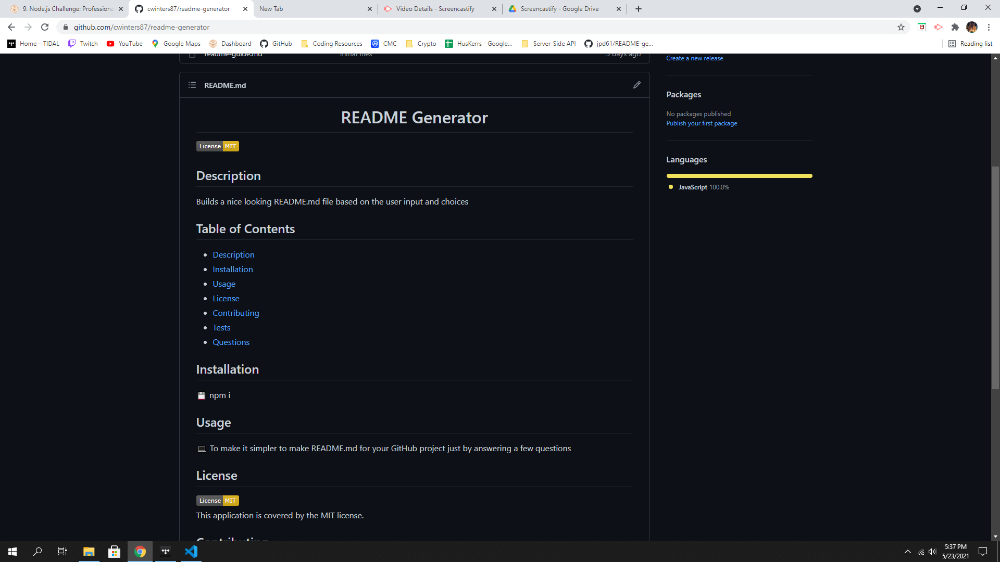
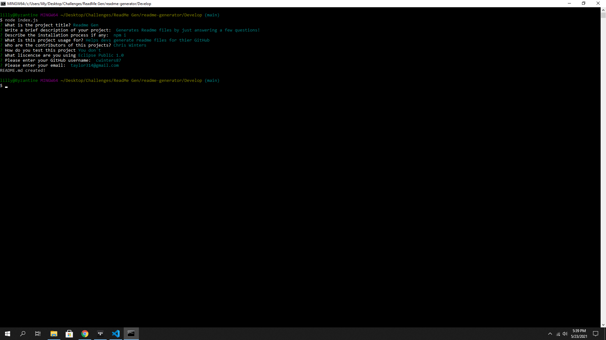

  <h1 align="center">README Generator</h1>
  
 
## Description
Builds a nice looking README.md file based on the user input and choices
## Table of Contents
- [Description](#description)
- [Installation](#installation)
- [Usage](#usage)
- [License](#license)
- [Contributing](#contributing)
- [Tests](#tests)
- [Questions](#questions)
## Installation
💾 npm i
## Usage
💻 To make it simpler to make README.md for your GitHub project just by answering a few questions
## License
   This application is covered by the MIT license.
## Contributing
👪 Chris Winters
## Tests
✏️ Click to view a Demo: https://drive.google.com/file/d/1S2Yx8n47qZ1PzpBfl0pDaow_h9GrLzXn/view?usp=sharing

## Questions
🙋‍♂️ Email or reach me on my GitHub  
 
:octocat: Find me on GitHub: [cwinters87](https://github.com/cwinters87) 
 
✉️ Email me with any questions: taylor314@gmail.com  
🌟This README was generated by Chris Winters using the [readme-generator](https://github.com/cwinters87/readme-generator)
